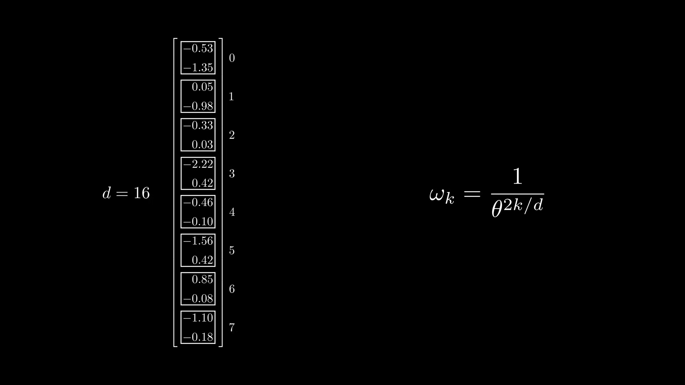
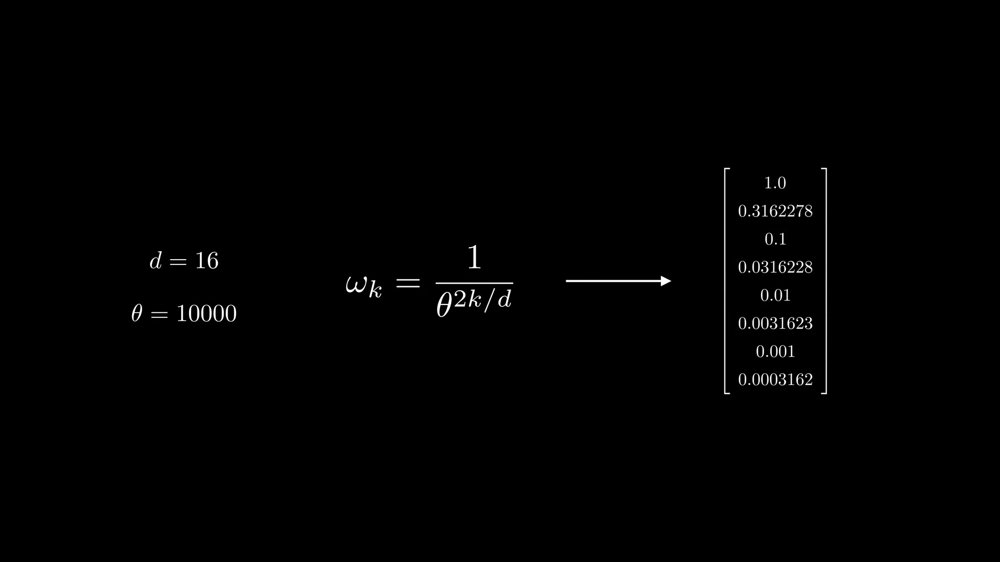
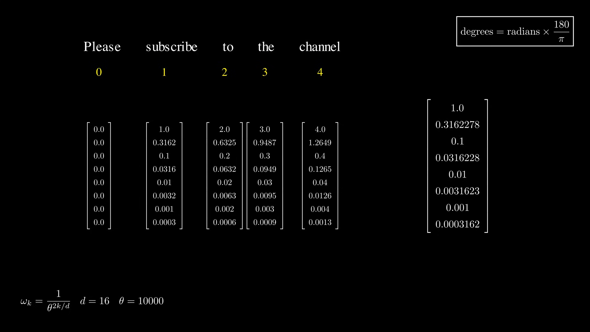

# Part1-位置编码：RoPE与YARN

## 理论

### RoPE



输入到模型中的 token 会先经过 word embedding，一个 token 会被编码成一个向量，如上图左所示。这里假设某个 token 被编码成图左侧那样的向量，维度为 16。这个维度通常被称为 **hidden size**，在代码中也常用变量名 **dim** 来指代。

对这个 token 做位置编码，本质上就是对这个向量做旋转。不过这里并不是把整个向量作为一个整体去旋转，而是把各个维度两两配对后，分别进行二维旋转。如上图所示，16 个维度被分成 8 组，每组两个分量。组号记为 k，取值范围是 0 到 7。

每组旋转的角度由下面的公式给出：
$$
\omega_k=\frac{1}{\theta^{2k/d}}
$$

> [!NOTE]
>
> 这里的 wk 虽然本质上是旋转角度，但在很多资料和文献中都会把它称为频率，因此本文也沿用这个说法。wk 大就被称为高频，wk 小就被称为低频。

k 为组号，\(\theta\) 为一个常数参数，在《Attention is all you need》中取值为 10000，后续一些工作又对这个参数做了改进。d 为 hidden size，计算结果的单位是 rad。上图左侧那个向量对应的计算结果如下：



下面以一句话 `Please subscribe to the channel` 为例，根据每个 token 的 word embedding，可以计算出各个 token 的频率如下：



设 w 为某个 token 对应的频率向量，则有

$$
{\vec \omega _{token}} = \vec \omega  \times token\_index
$$

比如，`channel` 对应的频率向量，就是把 w 整体乘以 4 得到的。比较靠前的 4.0、1.2649 等可以看作高频分量，而 0.004、0.0013 这样的值则属于低频分量。

如果把旋转写成复数形式，那么 RoPE 可以概括为
$$
f_{\boldsymbol{W}}(x_m,m,\theta)=e^{im\boldsymbol{\theta}}Wx_m
$$

> [!CAUTION]
>
> 注意：上式中的 \theta 指的是前文的频率向量 w。这里改写成 \theta，是因为 YaRN 论文中采用的就是这套记号，本文从这里开始也统一使用 \theta。

### YARN

论文对 YaRN 的论述，并不是“直接把 RoPE 改一下”这么简单，而是先分析为什么普通 RoPE 和 PI 在长上下文外推时会失效，再一步步构造出最终方法。按照论文原文的脉络，整个思路可以分成五步：

1. 普通RoPE在训练长度之外泛化很差
2. PI（Position Interpolation）把所有位置统一压缩到训练范围内
3. 统一压缩会损失高频信息，于是出现 `NTK-aware`
4. 进一步分析不同维度的波长性质，得到 `NTK-by-parts`
5. 最后再叠加 attention scaling，才得到完整的 `YaRN`

也就是说，严格按照论文定义，**YaRN = NTK-by-parts interpolation + attention scaling**，而不是单独的“分段缩放 RoPE 频率”。

#### 为什么普通RoPE不能直接外推

论文把预训练最大上下文长度记为 $L$，目标扩展长度记为 $L'$，并定义缩放倍数

$$
s=\frac{L'}{L}
$$

RoPE 虽然从形式上看是相对位置编码，但论文指出：在实际模型里，不同维度并不都只编码纯粹的相对位置信息。某些维度在整个训练上下文中甚至还没完成一次完整旋转，因此这些维度实际上会保留较强的绝对位置信息。一旦直接把上下文拉长，这部分维度就会落到分布外，模型表现也会明显下降。

#### PI：最早的统一插值方法

PI 的思想很直接：既然模型只见过长度 $L$ 的位置，那就把更长序列的位置重新映射回 $[0,L]$ 范围内。也就是把原本的位置 $m$ 映射成大约 $m/s$，从而避免直接外推到训练长度之外。

PI 的优点是简单、稳定，并且确实能把上下文长度扩展到比训练更长的范围；但它有一个明显的问题：它对所有 RoPE 维度都施加了相同的缩放压力，导致高频分量也被一起压扁。

#### NTK-aware：缓解高频信息损失

论文指出，PI 的主要副作用是**高频信息损失**。从频率角度看，RoPE 和 Fourier Features 很相似，高频分量对细粒度的位置区分非常重要。如果所有维度都统一缩放，高频部分就会被削弱，而且随着缩放倍数 $s$ 增大，这个问题会越来越严重。

因此 `NTK-aware` 的思路是：不要让所有维度缩放得一样多，而是让高频缩得更少，低频缩得更多。最早的做法是通过修改 RoPE 的 base 来间接实现这一点。它比 PI 效果更好，但仍然有两个问题：

- 最佳 base 很难直接算出来，通常需要经验调参
- 有些维度会被推到“插值”与“外推”之间的尴尬区域，理论解释不够清晰

#### NTK-by-parts：按波长分段处理

这是通向 YaRN 最关键的一步。论文没有直接从“频率大还是小”出发，而是引入了**波长**：

$$
\lambda_d=\frac{2\pi}{\theta_d}
$$

它表示第 $d$ 个 RoPE 维度完成一整圈旋转所对应的 token 长度。

有了波长以后，就可以更清楚地理解每个维度在训练窗口 $L$ 内扮演的角色：

- 如果 $\lambda_d \ll L$，说明该维度在训练窗口内已经转了很多圈，更偏向编码局部、相对位置信息，这类维度不应轻易改动
- 如果 $\lambda_d \ge L$，说明该维度在训练窗口内甚至转不满一圈，更偏向携带绝对位置信息，这类维度应优先做插值
- 中间区域则适合做平滑过渡

为此，论文又定义了旋转次数比例

$$
r=\frac{L}{\lambda}
$$

并引入两个边界参数 $\alpha,\beta$：

- 当 $r < \alpha$ 时，完全按PI方式插值
- 当 $r > \beta$ 时，不做插值
- 中间区间做线性ramp过渡

这就是 `NTK-by-parts` 的本质。它不是简单粗暴地“高频不动、低频缩小”，而是从“这个维度在训练窗口里到底转了几圈”来判断该不该插值，因此理论解释也比 `NTK-aware` 更清晰。

如果把它写成工程上更容易实现的形式，就会得到类似下面的频率修正：

$$
\theta'_k=\theta_k\cdot((1-\gamma_k)+\gamma_k/s)
$$

其中 $\gamma_k$ 是一个 0 到 1 之间的线性过渡系数。这个写法和本项目代码中的实现形式非常接近：高频区基本不动，低频区按 $1/s$ 缩放，中间区域线性过渡。

#### YaRN：在NTK-by-parts上再加attention scaling

论文中真正的 YaRN 还多了一步：它发现如果在 attention softmax 之前对 logits 加一个温度缩放，长上下文下的困惑度会更稳定。论文把这个温度记为 $t$，并说明这一步不一定要直接修改 attention 代码本身，而是可以通过等价方式去缩放 RoPE 之后的 `q` 和 `k` 来实现。

因此，论文原始定义里的YaRN包含两部分：

1. `NTK-by-parts interpolation`
2. `attention scaling`

这也是为什么论文专门强调，YaRN 与 Flash Attention 等实现兼容，因为它并不需要真的改写 attention 算子，只要提前把旋转位置编码按合适的比例缩放即可。

#### 本项目代码与论文原始YaRN的对应关系

本项目 `precompute_freqs` 的实现，核心上对应的是论文中的 `NTK-by-parts` 思想：

- `factor` 对应上下文扩展倍数 $s$
- `beta_fast` / `beta_slow` 对应论文里的分段边界参数
- `ramp` 对应论文中的线性过渡区

而代码里的 `attention_factor`，则是对论文里 attention scaling 的工程化实现。它直接乘在预先缓存好的 `cos/sin` 上，相当于把 RoPE 后的向量整体缩放一个常数。由于 attention 分数本质上来自 $q\cdot k$，因此这种做法可以在不改 attention 代码的情况下实现温度补偿。

从代码逻辑上看，只有当目标长度 `end` 大于原始训练长度 `original_max_position_embeddings` 时，才会真正进入这套缩放流程；否则就退化成普通RoPE。

## 程序
### 函数与接口定义

在本项目中，位置编码的实现主要由两个函数完成：

- `precompute_freqs`
- `apply_rotary_pos_emb`

前者负责预先计算所有位置对应的 `cos/sin` 表，后者负责把这些表应用到注意力层中的 `q` 和 `k` 上。

如果用论文术语来对应，那么这里的实现并不只是“普通 RoPE 工具函数”，而是把论文中的 `NTK-by-parts interpolation` 和 attention scaling 的一部分都折叠进了 `precompute_freqs` 这一步里。

#### precompute_freqs

函数定义如下：

```python
def precompute_freqs(
    dim: int,
    end: int = int(32 * 1024),
    rope_base: float = 1e6,
    rope_scaling: Optional[dict] = None,
)
```

其中各个参数的含义如下：

- `dim`：每个 attention head 的维度，也就是 RoPE 实际作用的向量长度。注意它不是整个 `hidden_size`，而是 `head_dim = hidden_size // num_attention_heads`
- `end`：要预计算到的最大位置数，也就是最多为多少个 token 位置生成 `cos/sin`
- `rope_base`：RoPE公式中的底数 `base`
- `rope_scaling`：可选的YARN配置字典；为 `None` 时表示使用普通RoPE

这里的 `Optional[dict]` 是 Python 类型标注，意思是“这个参数要么是一个 `dict`，要么是 `None`”，并不是一种新的运行时类型。

这个函数的返回值是：

```python
freqs_cos, freqs_sin
```

二者都可以理解为形状大致为 `[end, dim]` 的张量，表示从位置 0 到位置 `end-1` 的全部旋转参数表。

它的内部流程可以概括为：

1. 先根据 `dim` 和 `rope_base` 计算标准RoPE频率
2. 如果配置了 `rope_scaling` 且目标长度超过原始训练长度，则按YARN方式调整频率
3. 生成位置索引向量 `t = [0, 1, 2, ..., end-1]`
4. 做外积，得到每个位置、每个维度上的旋转角度
5. 对旋转角度取 `cos` 和 `sin`

该函数会在模型初始化时被调用一次，用于生成位置编码缓存，而不是每次前向都重新计算。

#### apply_rotary_pos_emb

函数定义如下：

```python
def apply_rotary_pos_emb(q, k, cos, sin, position_ids=None, unsqueeze_dim=1):
```

这个函数的作用，是把上一步得到的 `cos/sin` 真正应用到注意力层中的 query 和 key 上。实现方式不是直接“加位置向量”，而是把 `q` 和 `k` 的最后一个维度分成前后两半，通过

$$
x\cdot cos + rotate(x)\cdot sin
$$

的形式完成旋转。

在本项目实际使用时，各个输入张量的典型形状如下：

- `q`：`[bsz, seq_len, num_heads, head_dim]`
- `k`：`[bsz, seq_len, num_kv_heads, head_dim]`
- `cos`：`[seq_len, head_dim]`
- `sin`：`[seq_len, head_dim]`

返回值为：

- `q_embed`
- `k_embed`

它们的形状与输入的 `q`、`k` 保持一致。

需要注意的是，这个函数虽然定义了 `position_ids` 参数，但当前实现中并没有真正使用它。也就是说，本项目不是在函数内部根据 `position_ids` 选择位置，而是在外部先把对应位置范围的 `cos/sin` 切好，再传进来使用。

### 调用关系

这两个函数在模型中的调用链如下：

1. `MokioMindModel.__init__` 调用 `precompute_freqs`
2. 得到的 `freqs_cos` 和 `freqs_sin` 被注册为 buffer，作为整张位置编码表缓存下来
3. `MokioMindModel.forward` 根据当前序列起始位置 `start_pos` 和当前长度 `seq_length`，切出本轮所需的 `cos/sin`
4. 每个 `MokioMindBlock` 把这组 `position_embeddings` 继续传给 `Attention.forward`
5. `Attention.forward` 内部调用 `apply_rotary_pos_emb(xq, xk, cos, sin)`

可以看到，`precompute_freqs` 更偏向“初始化阶段的准备工作”，而 `apply_rotary_pos_emb` 则是“每次注意力计算时真正应用位置编码的步骤”。

### 与配置参数的对应关系

结合本项目配置，可以把几个容易混淆的概念再统一一下：

- `hidden_size`：一个 token 在模型主干中的总表示维度，也就是 embedding 长度和 hidden state 长度
- `num_attention_heads`：注意力头数
- `head_dim`：每个头分到的维度，等于 `hidden_size // num_attention_heads`
- `dim`：传给 `precompute_freqs` 的实际值，本质上就是 `head_dim`
- `end`：当前模型想预计算到的最大上下文长度，不一定等于预训练时的原始最大长度
- `original_max_position_embeddings`：模型原始训练时使用的最大上下文长度，用于判断是否需要做YARN外推

因此，`end` 更接近“当前要支持多长上下文”，而不是“模型训练时最初见过多长上下文”。当二者相同，模型只是在正常范围内使用 RoPE；当 `end` 更大时，就需要借助 YaRN 把 RoPE 扩展到更长上下文。
